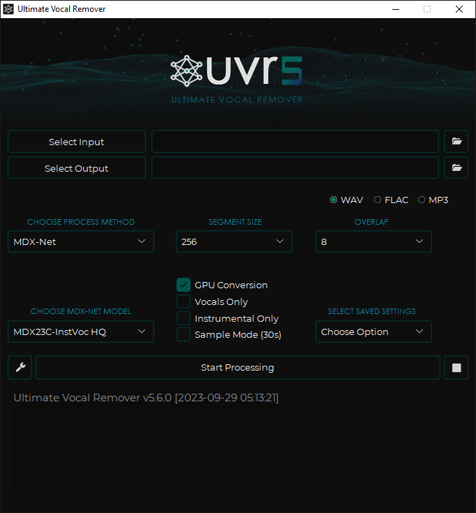

# GPT—SOVITS Notebook

## 1. 模型项目介绍和环境准备

### 1.1 项目说明

本项目基于开源项目 https://github.com/RVC-Boss/GPT-SoVITS 改动而成，该项目可以做到强大的少样本语音转换与语音合成，但只提供了webUI和api支持，并没有notebook和cli实现。

本项目在原始项目中添加了cli训练-推理脚本，并且添加该notebook文档，通过该文档能够实现整个数据处理、微调训练、推理语音合成的工作流。

## 1.2 环境准备

该项目所需要的所有第三方程序如(ffmpeg)和依赖已经在容器内包含，容器名称：gpt-sovits:jupyterlab-torch2.1-dtk23.04-py38，用户无需再进行依赖安装。

如不是使用该容器环境，则需要自行搭建相关环境，并且执行

`pip install -r requirements.txt`


## 2. 数据集处理

### 2.1 人声音频提取和增强

使用 UVR5 进行人声/伴奏分离和混响移除，该部分建议使用 https://github.com/Anjok07/ultimatevocalremovergui 项目在本地进行



### 2.2 人声切分
使用 tools/slice_audio.py 切分输入音频，其输入参数定义为

--input_path # 输入音频文件或目录

--output_root # 输出音频目录

--threshold  # 音量小于这个值视作静音的备选切割点

--min_length  # 每段最小多长，如果第一段太短一直和后面段连起来直到超过这个值

--min_interval  # 最短切割间隔

--hop_size  # 怎么算音量曲线，越小精度越大计算量越高（不是精度越大效果越好）

--max_sil_kept  # 切完后静音最多留多长

--alpha

--i_part  

--all_part 


需要确保输入目录下有音频文件，并且输出路径存在

`python tools/slice_audio.py   data/input_vocals/ data/sliced/ -34 4000 300 10 500 0.9 0.25 0 1`


### 2.3 使用asr进行文本标注

#### 2.3.1 仅中文asr

下载 `Damo ASR` 、`Damo VAD` 和 `Damo Punc` 三个模型

然后将模型文件移动到 `tools/asr/model` 目录下

执行中文asr标注

使用 tools/asr/funasr_asr.py 进行数据标注，其参数为 -i -o

input_dir 为之前切分好的音频目录 output_dir 为asr标注文件所在目录

`python tools/asr/funasr_asr.py -i data/leijun -o data/leijun_asr`


### 2.4 数据集预处理

使用处理脚本 dataset.py 对数据集进行预处理

`python dataset.py`

## 3. 微调训练

### 3.1 预训练模型获取

从[GPT-SoVITS Models](https://www.icloud.com.cn/iclouddrive/056y_Xog_HXpALuVUjscIwTtg#GPT-SoVITS_Models)下载预训练模型，并将它们放置在 `GPT_SoVITS\pretrained_models` 中。


### 3.2 SoVits模型微调

提供了sovits微调脚本 `train_sovits.py`

`python train_sovits.py`

### 3.3 GPT模型微调

提供了gpt微调脚本 `train_gpt.py`

`python train_gpt.py`

## 4. 开始推理

提供了基于微调的推理脚本 `infer.py`
```
使用方式

-input_text 在这里输入要生成的文本

--output_path 输出音频文件路径

--ref_wav_path 提示音频的路径

--prompt_text 提示文本的路径

--prompt_language 提示音频的语言

--text_language 输入文本的语言

--gpt_path gpt模型文件名

--sovits_path sovits模型文件名

"中文": "all_zh", # 全部按中文识别

"英文": "en", # 全部按英文识别#######不变

"日文": "all_ja", # 全部按日文识别

"中英混合": "zh", # 按中英混合识别####不变

"日英混合": "ja", # 按日英混合识别####不变

"多语种混合": "auto", # 多语种启动切分识别语种
```
执行推理脚本
```
python infer.py \
        --input_text="大家好，我是雷军！" \
        --text_language="all_zh" \
        --output_path="data/output_leijun.wav"
```

生成的音频文件

```
...
推理已完成！音频文件已保存到data/output_leijun.wav
TTS推理进程结束
```
